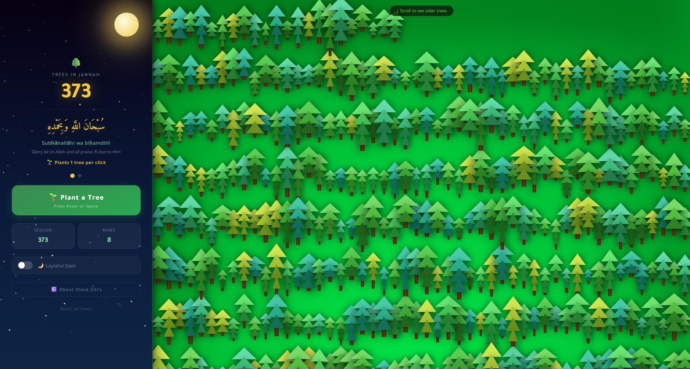

# 🌳 Zikr - Plant Trees in Jannah

> A beautiful, offline-first dhikr (remembrance) counter that visualises your worship as a growing forest in Jannah.



---

## ✨ What is this?

Every time you recite a dhikr, a tree is planted in your personal Jannah forest. The app is built around a well-known hadith:

> *"Whoever says 'Subḥānallāhi wa biḥamdihī' one hundred times a day, his sins will be forgiven even if they were as much as the foam of the sea."*
> - Ṣaḥīḥ al-Bukhārī & Muslim

The forest grows row by row, tree by tree - a living, visual record of your remembrance of Allah.

---

## 🖥️ Features

| Feature | Description |
|---|---|
| 🌿 **Two dhikrs** | Switch between *Subḥānallāhi wa biḥamdihī* (1 tree) and the four-phrase dhikr (4 trees) |
| 🌙 **Laylatul Qadr mode** | Toggle to multiply every deed ×1000, reflecting the night worth a thousand months |
| 🌳 **Growing forest** | Up to 1,500 trees rendered live in a scrollable Jannah landscape |
| 🎉 **Milestones** | Toast notifications at 10, 25, 50, 100 … 1,000,000,000,000 trees |
| 💾 **Persistent storage** | Your tree count survives page reloads via `localStorage` |
| ⌨️ **Keyboard support** | Press `Enter` or `Space` to plant - no mouse needed |
| 📖 **Hadith panel** | Tap *"About these Zikrs"* to read the source hadith for each dhikr |
| 🔄 **Reset** | Clear all data and start fresh at any time |

---

## 🚀 Getting Started

No build step, no dependencies, no server required.

```bash
git clone https://github.com/AbdulDevHub/zikr.git
cd zikr
open index.html        # macOS
# or just double-click index.html in your file manager
```

That's it. Open `index.html` in any modern browser.

---

## 📁 Project Structure

```
zikr/
├── index.html       # Everything - HTML, CSS, and JS in one file
├── Screenshot.png   # App preview image
└── README.md        # You are here
```

---

## 🕌 The Dhikrs

### 1 - Subḥānallāhi wa biḥamdihī · 🌿 1 tree per click

**سُبْحَانَ اللَّهِ وَبِحَمْدِهِ**

*"Glory be to Allah and all praise is due to Him"*

The Prophet ﷺ said: *"Two words light on the tongue, heavy on the Scale, beloved to the Most Merciful."*
- Ṣaḥīḥ al-Bukhārī & Muslim

---

### 2 - The Four Praises · 🌳 4 trees per click

**سُبْحَانَ اللَّهِ وَالْحَمْدُ لِلَّهِ وَلَا إِلَٰهَ إِلَّا اللَّهُ وَاللَّهُ أَكْبَرُ**

*"Glory be to Allah, praise to Allah, none worthy of worship but Allah, Allah is Greatest"*

The Prophet ﷺ said: *"The most beloved words to Allah are four - it does not matter which you begin with."*
- Ṣaḥīḥ Muslim

---

## 🌙 Laylatul Qadr Mode

Enabling the **Laylatul Qadr** toggle multiplies every click by **1,000**, reflecting the Quranic verse:

> *"The Night of Decree is better than a thousand months."* - Al-Qadr 97:3

Use this during the last ten nights of Ramadan, or as a reminder of the immense weight that sincerity carries.

---

## 🛠️ Customisation

All configuration lives at the top of the `<script>` block in `index.html`:

- **`ZIKRS`** - add, remove, or edit dhikr entries (Arabic text, transliteration, meaning, tree count)
- **`MILESTONES`** - customise the milestone messages and thresholds
- **`COLS`** - trees per row (default: 50)
- **`ROW_H`** - row height in pixels (default: 110)
- **`VISUAL_CAP`** - maximum trees rendered in the DOM at once (default: 1,500)

---

## 🤲 Intention

This tool is built as a gentle aid for the heart - not a replacement for sincerity, focus, or presence in worship. May every tree planted here be a witness on the Day of Judgement.

*"And your Lord is not forgetful."* - Maryam 19:64

---

## 📄 Licence

MIT - free to use, share, and build upon. If you improve it, consider sharing back.
